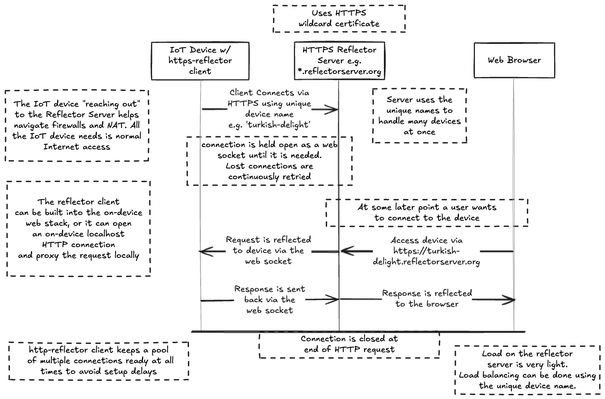

# HTTPS Reflector



## Setup

If you clone this repo and run `./setup.sh` you should end up with a
working HTTPS Reflector client with it's own local copy of the
specific version of node it's configured for.

You can try this on-device, or on your macOS/Linux laptop.

```
git clone https://github.com/ferguson/https-reflector
cd https-reflector
./setup.sh
```

You can test the install:

```
source ./activate
node --version  # should be v11.15.0
node --experimental-modules https-reflector-client.mjs --help
```

You should see:
```
Usage: https-reflector-client [options]

Options:
    --hub <url>             https-reflector server url
    --host <hostname>       hostname of local server to uplink to (default localhost)
    --port <number>         port to uplink to (default 9090)
    --devicename <name>     unique device name to use (defaults to hostname)
  -h, --help                display help for command
```

# Setting up the HTTPS Reflector Server

The server is designed to typically run with an HTTPS wildcard
certificate and DNS configured to route all subdmains (or "vhosts"
as the code refers to them) to the server. You can choose to run
without HTTPS and/or without subdomains. If you don't have subdomains
than it will only support a single device per server.

You should find all occurrences of `some-https-reflector-server.org`
in the code and `run.sh` and swap in your own domain name. This really
should be extracted out to a config file or command arguments
(someday).

The `.mjs` file extensions, the `--expermential-modules` flag for
`node`, and the weird `import` statements workarounds in the code are
all to support running this on an old version of node: v11.15.0. This
is because that was the newest version of node I could run on one of
the devices I needed to support.

Lookover `run.sh`, see if you need to change anything in there and
then `./run.sh` to launch the server. There is also an example
`https-reflector.service` file for systemd. The server is
assumed to be installed in `/usr/local/https-reflector`.

You can also run a test server in dev mode locally on your laptop (see below).

# Using the client

When you have a server available you can then run the client:

```
node --experimental-modules https-reflector-client.mjs --devicename air-solvent --host 10.99.0.70 --port 80 --hub "https://*.some-https-reflector-server.org"
```

That should look something like this:
```
using device name air-solvent
attempting an uplink connection to https://air-solvent.some-https-reflector-server.org/
socket.io connected
hub says to proceed
https-reflector server https://air-solvent.some-https-reflector-server.org/ connected
```

Adjust the IP address and port number to point to a web page
on one of your devices, or a local server on your laptop.

You should then be able to go to `https://air-solvent.some-https-reflector-server.org/`
and be connected to your device.

Note: `air-solvent` was just a unique name I picked randomly for the
device. You just have to use the same identifier when connecting with
your browser, as shown above.

# Running the server in dev mode

You can run the server locally using the `dev.sh` script. This
requires that you add a few entries to your `/etc/hosts` file:

```
127.0.0.1	localreflector
127.0.0.1	woot.localreflector
127.0.0.1	fruit.localreflector
127.0.0.1	toot.localreflector
```

Run `./dev.sh` in one terminal window, and then run the client in another window:

``` node --experimental-modules https-reflector-client.mjs --hub "http://*.localreflector" --host 10.99.0.70 --port 80 --devicename woot
```

Adjust the IP address and port number to point to a web page
on one of your devices, or a local server on your laptop.

The output from that should be:
```
using device name woot
attempting an uplink connection to http://woot.localreflector/
socket.io connected
hub says to proceed
https-reflector server http://woot.localreflector/ connected
```

Then you should be able to go to `http://woot.localreflector/` in your local browser (must be on the same machine).

You can optionally run additional clinets one or two more
times for more devices using the devicenames `fruit` and `toot`.
